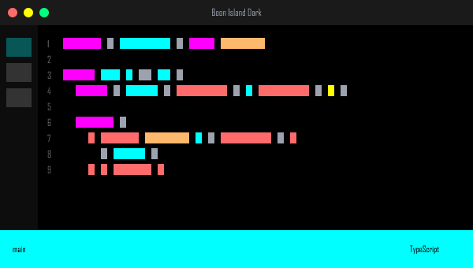
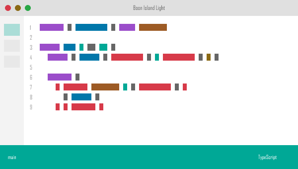
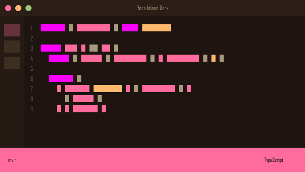
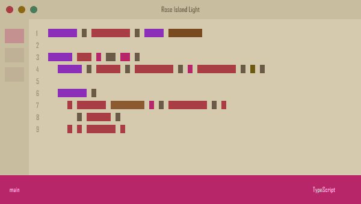

<p align="center">
  
</p>

---

# Lighthouse In The Dark

A retro 80s neon color theme for Visual Studio Code with four carefully crafted variants.

## Theme Variants

| Theme | Background | Accent | Vibe |
|-------|------------|--------|------|
| **Boon Island Dark** | Pure black | Electric Cyan | Neon arcade |
| **Boon Island Light** | White | Teal | Clean neon |
| **Rose Island Dark** | Warm brown | Hot Pink | Synthwave |
| **Rose Island Light** | Tan/cream | Rose | Warm retro |

## Installation

1. Open **Extensions** sidebar in VS Code
2. Search for `Lighthouse In The Dark`
3. Click **Install**
4. `Ctrl+Shift+P` / `Cmd+Shift+P` → **Preferences: Color Theme**
5. Select your preferred variant

## Features

**Syntax Highlighting**
- 35+ token scopes for precise highlighting
- TypeScript, JavaScript, Python, Go, Rust, HTML, CSS, JSON, Markdown
- Distinct colors for keywords, functions, variables, types, and operators

**UI Colors**
- Complete UI theming: editor, sidebar, tabs, statusbar, terminal
- Git decorations for added, modified, deleted, and untracked files
- Diff editor with clear insert/remove backgrounds
- Find/replace highlighting with visible borders
- Bracket matching and indent guides

**Terminal**
- Full 16-color ANSI palette with 80s neon aesthetic
- Bright variants for bold text

**Accessibility**
- All token colors meet WCAG contrast requirements
- Carefully balanced for extended coding sessions

---

## Theme Previews

### Boon Island Dark


### Boon Island Light


### Rose Island Dark


### Rose Island Light


---

## Development

```bash
# Package extension
vsce package

# Install locally
code --install-extension lighthouse-in-the-dark-0.1.0.vsix

# Test in VS Code
# Press F5 to launch Extension Development Host
```

## Contributing

Issues and PRs welcome at [GitHub](https://github.com/afj176/lighthouse-in-the-dark)
